<div align="center">
  
</div>

<br/>

<div align="center">

  
  
  
  
  
  

</div>

<br/>

<h1 align="center">
$\Huge \substack{
\color{#ffc30f}{\textsf{Subterra}} \\
\color{#888888}{\pmb{\texttt{Creative BTL Studio Website}}} \\
\color{#888888}{\texttt{Single-Page · CSS 3D Earth · Lima, PE}}
}$
</h1>

<p align="center">
  <em>A full-screen single-page marketing website with a <strong>3D spinning globe built from scratch</strong> — no WebGL, no canvas, no library — using only CSS, SCSS, vanilla JavaScript, and the circle equation.</em>
</p>

---

## Table of Contents

- [What is this?](#-what-is-this)
- [The 3D Earth — Zero Library, Pure Math](#-the-3d-earth--zero-library-pure-math)
- [Section Architecture](#-section-architecture)
- [The Navigation Engine](#-the-navigation-engine)
- [Services Carousel](#-services-carousel)
- [Math Captcha](#-math-captcha)
- [Colour System](#-colour-system)
- [Repository Structure](#-repository-structure)
- [Quick Start](#-quick-start)
- [About](#-about)

---

## 🌍 What is this?

**Subterra** is a single-page creative studio website built entirely from scratch.  
No Bootstrap. No Tailwind. No React. No framework at all.

Every transition, every animation, every interaction is hand-crafted in raw HTML, SCSS, and vanilla JavaScript.

The crown jewel is a **pure-CSS 3D spinning globe** constructed from 45 `<ul>` elements and 4,770 `<li>` items — zero WebGL, zero `<canvas>`, zero graphics library — powered by the **circle equation** and `transform-style: preserve-3d`.

---

## 🔢 The 3D Earth — Zero Library, Pure Math

The spinning globe on the home screen is not a GIF, not a canvas render, not a WebGL scene. It is a pile of HTML list items styled with CSS 3D transforms.

### The structure

The globe is built from **45 vertical rings** (`<ul>` elements), each rotated 4° around the Y axis:

```javascript
for (let i = 0; i < 45; i++) {
  $("#earth #earth-wrapper ul")[i].style.transform = "rotateY(" + (i * 4) + "deg)";
}
```

> 45 rings × 4° = 180° — a full hemisphere. The browser's CSS perspective projection mirrors the back half automatically.

Each ring contains **106 horizontal slices** (`<li>` items), stacked top to bottom. The **width of each slice** is the chord length of a sphere at that latitude, calculated using the **circle equation**:

$$y = 2\sqrt{r^2 - x^2}$$

```javascript
function circley(ix, radius) {
  var x2 = Math.pow(ix, 2);
  var r2 = Math.pow(radius, 2);
  return Math.sqrt(r2 - x2) * 2;  // chord width at distance ix from equator
}
```

| Variable | Meaning |
|---|---|
| `ix` | Distance from the equator (the `x` in the formula) |
| `radius` | Sphere radius — `320 ÷ 2 = 160 px` |
| Return | Width of the sphere at that latitude slice |

The function is called for every point along the diameter, generating an array of **107 chord widths**:

```javascript
function circleWithFromPoints(idiameter, ipoints) {
  var radius = idiameter / 2;
  var step   = idiameter / ipoints;
  var o = [];
  for (let i = 0; i <= idiameter; i = i + step) {
    var tx = i - radius;
    o.push( Math.round( circley(tx, radius) * 100 ) / 100 );
  }
  return o;
}

var circleWidths = circleWithFromPoints(320, 107);
```

Those widths are applied directly to the `<li>` elements as inline `style.width`:

```javascript
for (let j = 1; j <= 45; j++) {
  for (let i = (j - 1) * 106; i < j * 106; i++) {
    $("#earth #earth-wrapper ul li")[i].style.width =
      circleWidths[(i + 1) - ((j - 1) * 106)] + "px";
  }
}
```

Stack those slices vertically inside a `transform-style: preserve-3d` container, rotate each ring around Y, and the browser's own perspective projection renders a perfect sphere — **with zero drawing code**.

### The CSS rotation

```scss
.earth-rotation {
  animation: earth-rotation linear 66s infinite;
}

@keyframes earth-rotation {
  0%   { transform: translate(-50%,-50%) rotateY(-11deg)  rotateZ(0);   }
  50%  { transform: translate(-50%,-50%) rotateY(349deg)  rotateZ(33deg); }
  100% { transform: translate(-50%,-50%) rotateY(709deg)  rotateZ(0);   }
}
```

A full rotation takes **66 seconds** — unhurried, like the real thing.

### Click interactions

```javascript
// First click: stop rotation, start breathing
$("#earth").on("click", function() {
  $(this).removeClass("earth-rotation").addClass("earth-breath");
});

// Second click (on wrapper): spin to a random 3D angle
$("#earth-wrapper").on("click", function() {
  var r = Math.ceil(Math.random() * 360);
  $(this)[0].style.transform =
    "rotateX(" + r + "deg) rotateY(" + r + "deg) rotateZ(" + r + "deg)";
});
```

The transition from the idle state to the random orientation uses nothing but a CSS `transition: transform ease-in-out 2s` — no animation library required.

---

## 🗂 Section Architecture

The site is divided into **5 full-screen sections**. Navigation between them is a pure CSS height transition:

```scss
section {
  transition: height ease-in-out 0.5s;
  position: absolute;
  width: 100%;
  height: 0%;      // collapsed by default
  overflow: hidden;
}
.height-100 { height: 100% !important; }  // expanded
```

The incoming section slides in from above or below using absolute positioning combined with `top: 0` or `bottom: 0` classes applied during the transition — giving a natural directional feel.

| Section | Background | What lives here |
|---|---|---|
| `#home` | `rgb(0, 0, 30)` — deep navy | 3D Earth · brand name · slogan |
| `#service` | `rgb(255, 255, 225)` — ivory | 16 services · video carousel |
| `#about` | `rgb(255, 195, 15)` — gold | Agency description |
| `#gallery` | `rgb(210, 240, 240)` — pale cyan | MapBox interactive map |
| `#contact` | `rgb(0, 0, 0)` — black | Diamond-grid contact form |

Every section has a matching **nav theme** — the entire navigation bar (icons, text, dots) recolors itself to match the active section via a `body.theme-*` SCSS engine:

```javascript
function currentSectionTheme() {
  currentSectionThemeEngine("#home",    "theme-home",    ...);
  currentSectionThemeEngine("#service", "theme-service", ...);
  currentSectionThemeEngine("#about",   "theme-about",   ...);
  currentSectionThemeEngine("#gallery", "theme-gallery", ...);
  currentSectionThemeEngine("#contact", "theme-contact", ...);
}
```

Zero JavaScript style manipulation on individual nav items. The SCSS `body.theme-*` rules handle every color change with CSS `transition` for smooth recoloring.

---

## ⌨️ The Navigation Engine

All input methods — **mouse wheel, touch swipe, and keyboard arrows** — funnel into a single navigation engine:

```javascript
function navUpEngine(CurrentSection, CurrentSectionPos, NextSection, NextSectionPos) {
  if ($(CurrentSection).hasClass("current")) {
    // Collapse the current section
    $(CurrentSection)
      .removeClass("current").removeClass("height-100")
      .addClass(CurrentSectionPos)
      .delay(600).queue(function() {
        $(this).removeClass("z-index-10").removeClass(CurrentSectionPos).dequeue();
      });
    // Expand the next section
    $(NextSection)
      .addClass("current").addClass("height-100")
      .addClass(NextSectionPos).addClass("z-index-20")
      .delay(600).queue(function() {
        $(this).removeClass("z-index-20").removeClass(NextSectionPos).addClass("z-index-10").dequeue();
      });
  }
}
```

The same function handles every directional transition. The three input types just call `navUp()` or `navDown()`:

```javascript
// ── Mouse wheel ──────────────────────────────────
window.addEventListener('wheel', function(event) {
  if (event.deltaY < 0) { navUp(); } else { navDown(); }
});

// ── Touch swipe ──────────────────────────────────
function handleTouchMove(evt) {
  var yDiff = yDown - evt.touches[0].clientY;
  if (yDiff > 0) { navDown(); } else { navUp(); }
  // Horizontal swipe advances the service carousel:
  var xDiff = xDown - evt.touches[0].clientX;
  if (Math.abs(xDiff) > Math.abs(yDiff)) {
    if (xDiff > 0) { engineServiceClassName(1); }
    else           { engineServiceClassName(-1); }
    engineServiceStyle();
  }
}

// ── Keyboard arrows ──────────────────────────────
document.onkeydown = function(event) {
  switch (event.keyCode) {
    case 38: navUp();                  break; // ↑
    case 40: navDown();                break; // ↓
    case 39: engineServiceClassName(1); engineServiceStyle(); break; // →
    case 37: engineServiceClassName(-1); engineServiceStyle(); break; // ←
  }
};
```

One codebase. Three input methods. Flawless.

---

## 🎞 Services Carousel

The services section hosts **16 video cards**, each inside a circular frame — pure CSS:

```scss
#service-image li {
  border-radius: 50%;   // clips the video to a perfect circle
  overflow: hidden;
  width:  320px;
  height: 320px;
}
```

Each circular frame contains a looping, muted WebM video injected by JavaScript:

```javascript
for (let i = 1; i <= 16; i++) {
  $("#service-image ul li:nth-child(" + i + ") video")[0].innerHTML =
    "<source src='media/services/" + i + ".webm' type='video/webm'>";
}
for (let i = 0; i < 16; i++) { $("video")[i].play(); }
```

Navigation via the left/right arrows (or ← → keys, or horizontal swipe) uses a class-name engine: `service-1` through `service-16` on the wrapper. The active card's title, description, and video flip in; all others flip out via CSS `rotateX` / `rotateY` transitions:

```javascript
// Title & description: flip on X axis
li.style.transform = "rotateX(90deg)";  // hidden (folded away)
li.style.transform = "rotateX(0)";      // visible (flat)

// Video card: flip on Y axis
li.style.transform = "rotateY(90deg)";  // hidden
li.style.transform = "rotateY(0)";      // visible
```

### The 16 services

| # | Servicio | Description |
|---|---|---|
| 1 | **Impulsadoras** | Advertising field operations |
| 2 | **Convenciones** | Event planning & management |
| 3 | **Concursos** | Game-based advertising campaigns |
| 4 | **Anfitrionismo** | Event hosting & animation |
| 5 | **Conferencias** | Exhibition organisation |
| 6 | **Ferias** | Food & game promotional fairs |
| 7 | **Material P.O.P** | Inflatables, notebooks, caps, pens, keyrings, USBs, pins, balloons… |
| 8 | **Merchandising corporativo** | Custom branded products |
| 9 | **Fiestas corporativas** | Catered corporate parties with staff, food, drinks, music |
| 10 | **Impresiones** | Banners, posters, stickers, flyers… |
| 11 | **Activaciones** | Interactive brand interventions |
| 12 | **Sampling** | Live product demonstrations to the public |
| 13 | **Scouting** | Talent search & preparation |
| 14 | **Módulos** | Corporate stands |
| 15 | **Capacitaciones** | Employee & new staff training |
| 16 | **Workshops** | Workshops for employees and clients |

---

## 🧮 Math Captcha

The contact form uses a **hand-rolled arithmetic captcha** — no reCAPTCHA, no third-party dependency:

```javascript
var xAddendA = Math.ceil(Math.random() * 99);   // 1 – 99
var xAddendB = Math.floor(Math.random() * 99);  // 0 – 98

// Rendered in the DOM: "42 + 17 = ___"
$("#addend-a")[0].innerHTML = xAddendA;
$("#addend-b")[0].innerHTML = xAddendB;

// Validated on submit
$("#form-send")[0].addEventListener("click", function(e) {
  if (Number($("#form-captcha")[0].value) === (xAddendA + xAddendB)) {
    // ✓ correct — proceed
  } else {
    $("#form-captcha")[0].value = ""; // ✗ clear and try again
  }
});
```

Fresh random numbers on every page load. No cookies. No tokens. No server round-trip.

---

## 🎨 Colour System

Every section lives in its own tight colour palette, all defined in SCSS:

| Token | Value | Used in |
|---|---|---|
| Deep Navy | `rgb(0, 0, 30)` | Home background, default UI |
| Ivory | `rgb(255, 255, 225)` | Text on dark backgrounds, service bg |
| Gold | `rgb(255, 195, 15)` | Accent, About section bg, send button |
| Pale Cyan | `rgb(210, 240, 240)` | Gallery section background |
| Pure Black | `rgb(0, 0, 0)` | Contact section background |
| Earth Blue | `rgba(120, 180, 255, 0.25)` | Globe meridian lines |
| Dark Mahogany | `rgb(75, 15, 0)` | Service text colour |

Typography is built on **4 weights of Helvetica Neue LT** loaded as custom webfonts in all four legacy formats (`.eot`, `.svg`, `.ttf`, `.woff`):

| Class | Font | Weight |
|---|---|---|
| `font-family: "helvetica-1"` | HelveticaNeueLTPro 25 | Ultra Light |
| `font-family: "helvetica-3"` | HelveticaNeueLTPro 35 | Thin |
| `font-family: "helvetica-6"` | HelveticaNeueLTPro 45 | Light |
| `font-family: "helvetica-bold"` | HelveticaNeueLTStd 75 | Bold |

---

## 📁 Repository Structure

```
📦 subterra
 ┣ 📄 index.html                              ← The entire app — one file
 ┣ 📁 css/
 │  ┣ 📄 main.css                             ← Compiled CSS output
 │  ┣ 📄 main.css.map                         ← Source map
 │  ┗ 📁 sass/
 │     ┣ 📄 main.scss                         ← Master SCSS (imports all partials)
 │     ┣ 📄 _animation.scss                   ← All keyframe animations
 │     ┣ 📄 _font.scss                        ← @font-face declarations
 │     ┣ 📄 _mixins-prefix.scss               ← Vendor-prefix mixin
 │     ┗ 📄 _reset.scss                       ← CSS reset
 ┣ 📁 js/
 │  ┣ 📄 main.js                              ← Earth · navigation · services · form
 │  ┣ 📄 earth.js                             ← Earth CSS rotation animation helper
 │  ┣ 📄 jquery.min.js                        ← jQuery (DOM helpers only)
 │  ┗ 📄 html5shiv.min.js                     ← Legacy IE HTML5 support
 ┣ 📁 font/
 │  ┗ 📄 HelveticaNeueLT*.{eot,svg,ttf,woff}  ← 4 weights × 4 formats = 16 files
 ┣ 📁 media/
 │  ┗ 📁 services/
 │     ┗ 📄 1.webm … 16.webm                  ← 16 service showcase videos
 ┣ 📁 img/
 │  ┣ 📄 logo-social-networking.jpg           ← Social share preview image
 │  ┗ 📁 icon/                                ← Favicon package (all sizes + manifests)
 ┗ 📄 banner.svg                              ← Animated banner (this page's header)
```

---

## 🚀 Quick Start

No build step required. Just open `index.html` in any modern browser:

```bash
# Clone and open
git clone <repo-url>
cd subterra

open index.html        # macOS
xdg-open index.html    # Linux
start index.html       # Windows
```

> Requires a browser with **WebM video** support and **CSS `transform-style: preserve-3d`** — every modern browser qualifies.

For SCSS compilation (optional — compiled `main.css` is already included):

```bash
sass --watch css/sass/main.scss:css/main.css
```

### Navigation

| Input | Action |
|---|---|
| Mouse wheel ↑ / ↓ | Navigate between sections |
| Touch swipe ↑ / ↓ | Navigate between sections |
| Touch swipe ← / → | Advance the services carousel |
| Keyboard `↑` `↓` | Navigate between sections |
| Keyboard `←` `→` | Advance the services carousel |
| Click on globe | Stop rotation → breathing mode |
| Click on globe (again) | Spin to a random 3D orientation |

---

## 🌐 About

Created by **[X-Ray World](https://www.x-ray.world/)** — a creative studio exploring the edges of code, art, and design.

<div align="center">
  <br/>
  <a href="https://www.x-ray.world/">
    
  </a>
  <br/><br/>
  <sub>© X-Ray World Corporation · All rights reserved</sub>
</div>
