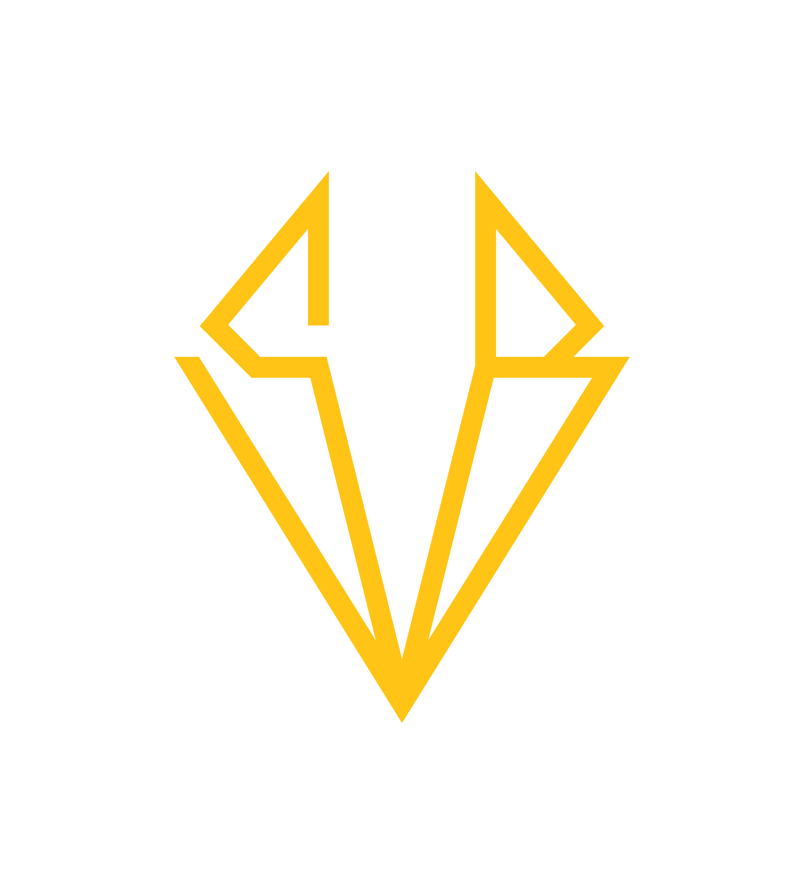
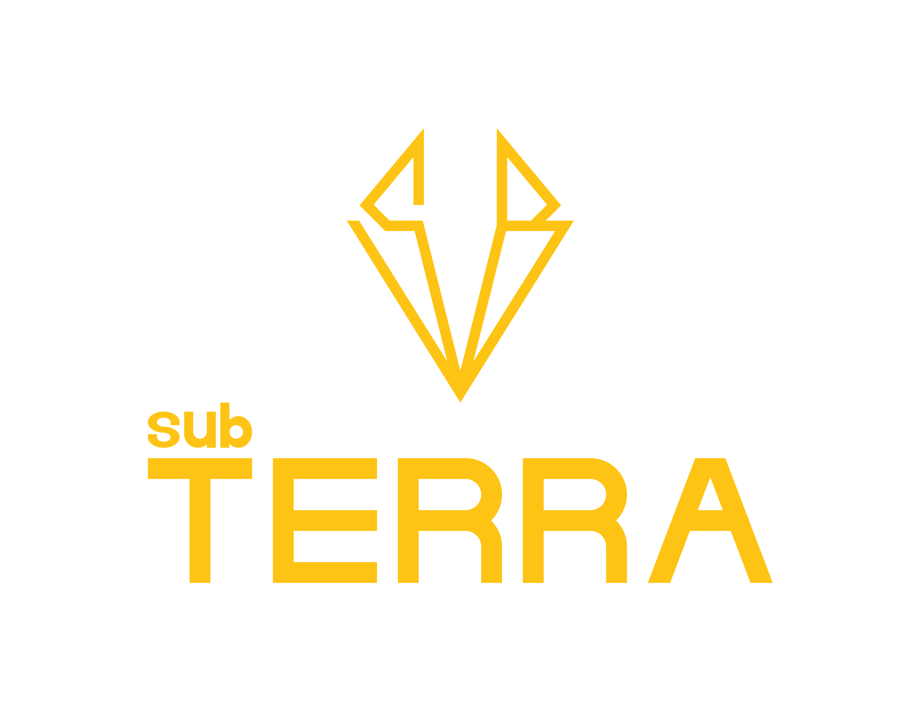
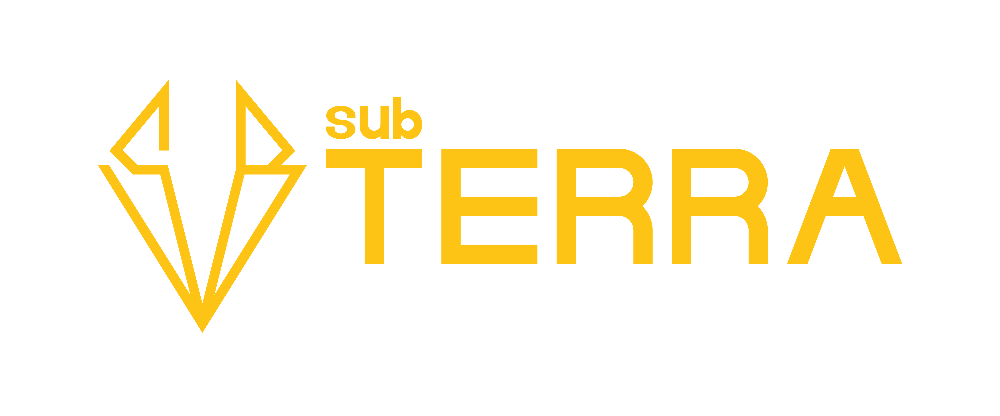
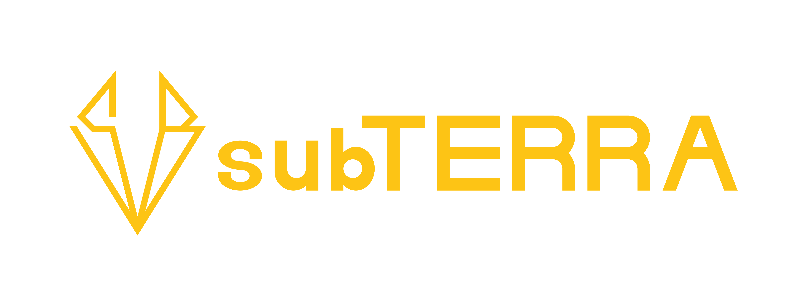
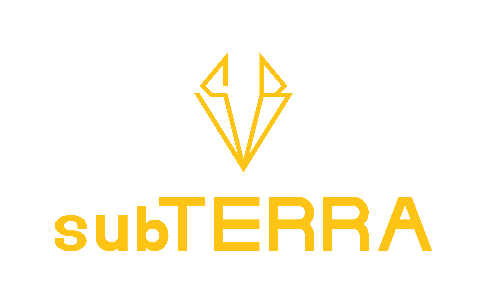
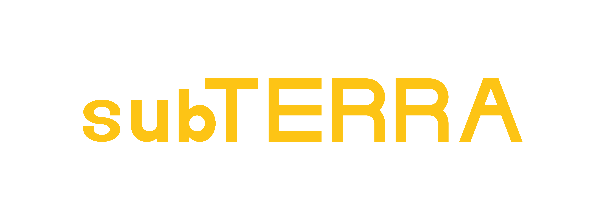
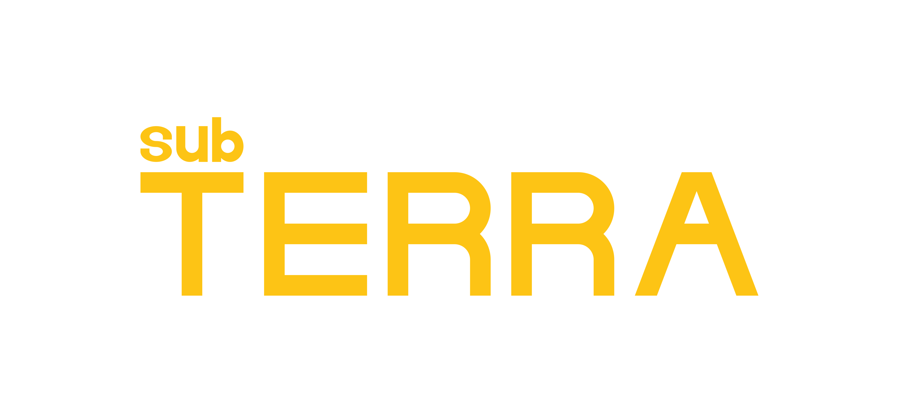

<p align="center">
  
</p>

<br/>

<div align="center">

# SUBTERRA
# (Página web)
# <a href="https://www.x-ray.world/tech">www.x-ray.world/tech</a>

*"Hecho por www.x-ray.world"*

  
  
  
  
  
  

</div>

<p align="center">
  <em>A full-screen single-page marketing website with a <strong>3D spinning globe built from scratch</strong> — no WebGL, no canvas, no library — using only CSS, SCSS, vanilla JavaScript, and the circle equation.</em>
</p>

---

## Table of Contents

- [What is this?](#-what-is-this)
- [The 3D Earth — Zero Library, Pure Math](#-the-3d-earth--zero-library-pure-math)
- [Section Architecture](#-section-architecture)
- [The Navigation Engine](#-the-navigation-engine)
- [Services Carousel](#-services-carousel)
- [Math Captcha](#-math-captcha)
- [Colour System](#-colour-system)
- [Brand Identity — The Symbol](#-brand-identity--the-symbol)
- [Brand Identity — The Logo System](#-brand-identity--the-logo-system)
- [Brand Identity — Colour Palette](#-brand-identity--colour-palette)
- [Repository Structure](#-repository-structure)
- [Quick Start](#-quick-start)
- [About](#-about)

---

## 🌍 What is this?

**Subterra** is a single-page creative studio website built entirely from scratch.  
No Bootstrap. No Tailwind. No React. No framework at all.

Every transition, every animation, every interaction is hand-crafted in raw HTML, SCSS, and vanilla JavaScript.

The crown jewel is a **pure-CSS 3D spinning globe** constructed from 45 `<ul>` elements and 4,770 `<li>` items — zero WebGL, zero `<canvas>`, zero graphics library — powered by the **circle equation** and `transform-style: preserve-3d`.

---

## 🔢 The 3D Earth — Zero Library, Pure Math

The spinning globe on the home screen is not a GIF, not a canvas render, not a WebGL scene. It is a pile of HTML list items styled with CSS 3D transforms.

### The structure

The globe is built from **45 vertical rings** (`<ul>` elements), each rotated 4° around the Y axis:

```javascript
for (let i = 0; i < 45; i++) {
  $("#earth #earth-wrapper ul")[i].style.transform = "rotateY(" + (i * 4) + "deg)";
}
```

> 45 rings × 4° = 180° — a full hemisphere. The browser's CSS perspective projection mirrors the back half automatically.

Each ring contains **106 horizontal slices** (`<li>` items), stacked top to bottom. The **width of each slice** is the chord length of a sphere at that latitude, calculated using the **circle equation**:

$$y = 2\sqrt{r^2 - x^2}$$

```javascript
function circley(ix, radius) {
  var x2 = Math.pow(ix, 2);
  var r2 = Math.pow(radius, 2);
  return Math.sqrt(r2 - x2) * 2;  // chord width at distance ix from equator
}
```

| Variable | Meaning |
|---|---|
| `ix` | Distance from the equator (the `x` in the formula) |
| `radius` | Sphere radius — `320 ÷ 2 = 160 px` |
| Return | Width of the sphere at that latitude slice |

The function is called for every point along the diameter, generating an array of **107 chord widths**:

```javascript
function circleWithFromPoints(idiameter, ipoints) {
  var radius = idiameter / 2;
  var step   = idiameter / ipoints;
  var o = [];
  for (let i = 0; i <= idiameter; i = i + step) {
    var tx = i - radius;
    o.push( Math.round( circley(tx, radius) * 100 ) / 100 );
  }
  return o;
}

var circleWidths = circleWithFromPoints(320, 107);
```

Those widths are applied directly to the `<li>` elements as inline `style.width`:

```javascript
for (let j = 1; j <= 45; j++) {
  for (let i = (j - 1) * 106; i < j * 106; i++) {
    $("#earth #earth-wrapper ul li")[i].style.width =
      circleWidths[(i + 1) - ((j - 1) * 106)] + "px";
  }
}
```

Stack those slices vertically inside a `transform-style: preserve-3d` container, rotate each ring around Y, and the browser's own perspective projection renders a perfect sphere — **with zero drawing code**.

### The CSS rotation

```scss
.earth-rotation {
  animation: earth-rotation linear 66s infinite;
}

@keyframes earth-rotation {
  0%   { transform: translate(-50%,-50%) rotateY(-11deg)  rotateZ(0);   }
  50%  { transform: translate(-50%,-50%) rotateY(349deg)  rotateZ(33deg); }
  100% { transform: translate(-50%,-50%) rotateY(709deg)  rotateZ(0);   }
}
```

A full rotation takes **66 seconds** — unhurried, like the real thing.

### Click interactions

```javascript
// First click: stop rotation, start breathing
$("#earth").on("click", function() {
  $(this).removeClass("earth-rotation").addClass("earth-breath");
});

// Second click (on wrapper): spin to a random 3D angle
$("#earth-wrapper").on("click", function() {
  var r = Math.ceil(Math.random() * 360);
  $(this)[0].style.transform =
    "rotateX(" + r + "deg) rotateY(" + r + "deg) rotateZ(" + r + "deg)";
});
```

The transition from the idle state to the random orientation uses nothing but a CSS `transition: transform ease-in-out 2s` — no animation library required.

---

## 🗂 Section Architecture

The site is divided into **5 full-screen sections**. Navigation between them is a pure CSS height transition:

```scss
section {
  transition: height ease-in-out 0.5s;
  position: absolute;
  width: 100%;
  height: 0%;      // collapsed by default
  overflow: hidden;
}
.height-100 { height: 100% !important; }  // expanded
```

The incoming section slides in from above or below using absolute positioning combined with `top: 0` or `bottom: 0` classes applied during the transition — giving a natural directional feel.

| Section | Background | What lives here |
|---|---|---|
| `#home` | `rgb(0, 0, 30)` — deep navy | 3D Earth · brand name · slogan |
| `#service` | `rgb(255, 255, 225)` — ivory | 16 services · video carousel |
| `#about` | `rgb(255, 195, 15)` — gold | Agency description |
| `#gallery` | `rgb(210, 240, 240)` — pale cyan | MapBox interactive map |
| `#contact` | `rgb(0, 0, 0)` — black | Diamond-grid contact form |

Every section has a matching **nav theme** — the entire navigation bar (icons, text, dots) recolors itself to match the active section via a `body.theme-*` SCSS engine:

```javascript
function currentSectionTheme() {
  currentSectionThemeEngine("#home",    "theme-home",    ...);
  currentSectionThemeEngine("#service", "theme-service", ...);
  currentSectionThemeEngine("#about",   "theme-about",   ...);
  currentSectionThemeEngine("#gallery", "theme-gallery", ...);
  currentSectionThemeEngine("#contact", "theme-contact", ...);
}
```

Zero JavaScript style manipulation on individual nav items. The SCSS `body.theme-*` rules handle every color change with CSS `transition` for smooth recoloring.

---

## ⌨️ The Navigation Engine

All input methods — **mouse wheel, touch swipe, and keyboard arrows** — funnel into a single navigation engine:

```javascript
function navUpEngine(CurrentSection, CurrentSectionPos, NextSection, NextSectionPos) {
  if ($(CurrentSection).hasClass("current")) {
    // Collapse the current section
    $(CurrentSection)
      .removeClass("current").removeClass("height-100")
      .addClass(CurrentSectionPos)
      .delay(600).queue(function() {
        $(this).removeClass("z-index-10").removeClass(CurrentSectionPos).dequeue();
      });
    // Expand the next section
    $(NextSection)
      .addClass("current").addClass("height-100")
      .addClass(NextSectionPos).addClass("z-index-20")
      .delay(600).queue(function() {
        $(this).removeClass("z-index-20").removeClass(NextSectionPos).addClass("z-index-10").dequeue();
      });
  }
}
```

The same function handles every directional transition. The three input types just call `navUp()` or `navDown()`:

```javascript
// ── Mouse wheel ──────────────────────────────────
window.addEventListener('wheel', function(event) {
  if (event.deltaY < 0) { navUp(); } else { navDown(); }
});

// ── Touch swipe ──────────────────────────────────
function handleTouchMove(evt) {
  var yDiff = yDown - evt.touches[0].clientY;
  if (yDiff > 0) { navDown(); } else { navUp(); }
  // Horizontal swipe advances the service carousel:
  var xDiff = xDown - evt.touches[0].clientX;
  if (Math.abs(xDiff) > Math.abs(yDiff)) {
    if (xDiff > 0) { engineServiceClassName(1); }
    else           { engineServiceClassName(-1); }
    engineServiceStyle();
  }
}

// ── Keyboard arrows ──────────────────────────────
document.onkeydown = function(event) {
  switch (event.keyCode) {
    case 38: navUp();                  break; // ↑
    case 40: navDown();                break; // ↓
    case 39: engineServiceClassName(1); engineServiceStyle(); break; // →
    case 37: engineServiceClassName(-1); engineServiceStyle(); break; // ←
  }
};
```

One codebase. Three input methods. Flawless.

---

## 🎞 Services Carousel

The services section hosts **16 video cards**, each inside a circular frame — pure CSS:

```scss
#service-image li {
  border-radius: 50%;   // clips the video to a perfect circle
  overflow: hidden;
  width:  320px;
  height: 320px;
}
```

Each circular frame contains a looping, muted WebM video injected by JavaScript:

```javascript
for (let i = 1; i <= 16; i++) {
  $("#service-image ul li:nth-child(" + i + ") video")[0].innerHTML =
    "<source src='media/services/" + i + ".webm' type='video/webm'>";
}
for (let i = 0; i < 16; i++) { $("video")[i].play(); }
```

Navigation via the left/right arrows (or ← → keys, or horizontal swipe) uses a class-name engine: `service-1` through `service-16` on the wrapper. The active card's title, description, and video flip in; all others flip out via CSS `rotateX` / `rotateY` transitions:

```javascript
// Title & description: flip on X axis
li.style.transform = "rotateX(90deg)";  // hidden (folded away)
li.style.transform = "rotateX(0)";      // visible (flat)

// Video card: flip on Y axis
li.style.transform = "rotateY(90deg)";  // hidden
li.style.transform = "rotateY(0)";      // visible
```

### The 16 services

| # | Servicio | Description |
|---|---|---|
| 1 | **Impulsadoras** | Advertising field operations |
| 2 | **Convenciones** | Event planning & management |
| 3 | **Concursos** | Game-based advertising campaigns |
| 4 | **Anfitrionismo** | Event hosting & animation |
| 5 | **Conferencias** | Exhibition organisation |
| 6 | **Ferias** | Food & game promotional fairs |
| 7 | **Material P.O.P** | Inflatables, notebooks, caps, pens, keyrings, USBs, pins, balloons… |
| 8 | **Merchandising corporativo** | Custom branded products |
| 9 | **Fiestas corporativas** | Catered corporate parties with staff, food, drinks, music |
| 10 | **Impresiones** | Banners, posters, stickers, flyers… |
| 11 | **Activaciones** | Interactive brand interventions |
| 12 | **Sampling** | Live product demonstrations to the public |
| 13 | **Scouting** | Talent search & preparation |
| 14 | **Módulos** | Corporate stands |
| 15 | **Capacitaciones** | Employee & new staff training |
| 16 | **Workshops** | Workshops for employees and clients |

---

## 🧮 Math Captcha

The contact form uses a **hand-rolled arithmetic captcha** — no reCAPTCHA, no third-party dependency:

```javascript
var xAddendA = Math.ceil(Math.random() * 99);   // 1 – 99
var xAddendB = Math.floor(Math.random() * 99);  // 0 – 98

// Rendered in the DOM: "42 + 17 = ___"
$("#addend-a")[0].innerHTML = xAddendA;
$("#addend-b")[0].innerHTML = xAddendB;

// Validated on submit
$("#form-send")[0].addEventListener("click", function(e) {
  if (Number($("#form-captcha")[0].value) === (xAddendA + xAddendB)) {
    // ✓ correct — proceed
  } else {
    $("#form-captcha")[0].value = ""; // ✗ clear and try again
  }
});
```

Fresh random numbers on every page load. No cookies. No tokens. No server round-trip.

---

## 🎨 Colour System

Every section lives in its own tight colour palette, all defined in SCSS:

| Token | Value | Used in |
|---|---|---|
| Deep Navy | `rgb(0, 0, 30)` | Home background, default UI |
| Ivory | `rgb(255, 255, 225)` | Text on dark backgrounds, service bg |
| Gold | `rgb(255, 195, 15)` | Accent, About section bg, send button |
| Pale Cyan | `rgb(210, 240, 240)` | Gallery section background |
| Pure Black | `rgb(0, 0, 0)` | Contact section background |
| Earth Blue | `rgba(120, 180, 255, 0.25)` | Globe meridian lines |
| Dark Mahogany | `rgb(75, 15, 0)` | Service text colour |

Typography is built on **4 weights of Helvetica Neue LT** loaded as custom webfonts in all four legacy formats (`.eot`, `.svg`, `.ttf`, `.woff`):

| Class | Font | Weight |
|---|---|---|
| `font-family: "helvetica-1"` | HelveticaNeueLTPro 25 | Ultra Light |
| `font-family: "helvetica-3"` | HelveticaNeueLTPro 35 | Thin |
| `font-family: "helvetica-6"` | HelveticaNeueLTPro 45 | Light |
| `font-family: "helvetica-bold"` | HelveticaNeueLTStd 75 | Bold |

---

## 💎 Brand Identity — The Symbol

<div align="center">
  
</div>

<br/>

The **Subterra symbol** — the *isotipo* — is the standalone icon of the company. It appears without the wordmark in any context where the brand is already known: favicons, social avatars, embossed stationery, watermarks, pin badges, app icons. It needs no name beside it.

### Anatomy of the symbol

The form is a **downward-pointing gemstone** — a brilliant-cut diamond viewed face-on, drawn entirely in pure line art. A single uniform stroke weight traces the entire silhouette. There are no fills, no gradients, no shadows — only the golden contour of a precision-cut crystal aiming at the earth.

The overall silhouette follows the profile of a cut gem: wide at the shoulder, tapering through the crown, then converging to a sharp point at the base — the way a jewel looks when held to the light and observed straight-on.

---

#### The upper crown — two faceted peaks

The symbol's crown divides into **two distinct upward peaks**, separated by a narrow gap at the top centre. They rise like the twin table facets of a cut stone.

**Left peak — the S facet**

The left contour traces a reverse-curve bracket — an angular form that opens to the lower right. Read as a letter, it is an abstracted **S**, the initial of *"Sub"*. The geometry is not decorative: it is structural, and it carries meaning. The S is built into the wall of the gem itself.

**Right peak — the T/B facet**

The right side presents an angular bracket with a nested inner triangle — a smaller diamond shape enclosed within the larger one. Read as a letter, it suggests a **T** (for *Terra*) or a **B**. The nested inner shape is a facet within a facet: a secondary crystal living inside the primary form. This doubling adds visual depth and rewards close reading.

Together, both peaks carry the brand's initials — **S** and **T** — hidden inside pure geometry. They are legible on close inspection; invisible at first glance. The logo holds a secret that reveals itself over time.

---

#### The lower pavilion — the triple convergence

Below the crown, three lines extend downward and converge to a **single sharp point** at the base.

| Line | Description |
|---|---|
| **Left pavilion** | The outer left wall of the gem's base — angled approximately 60° inward from vertical |
| **Centre spine** | The gem's deepest axis — near-vertical — the visual backbone of the entire mark |
| **Right pavilion** | The outer right wall — a mirror of the left, angled 60° inward from vertical |

These three lines form a clean downward fan — the pavilion of the gemstone, the part that lies deepest below the girdle. The eye follows all three lines simultaneously toward a single destination: the sharp terminal point at the bottom. It is the most kinetic, most directed element of the mark. Everything moves down.

---

#### Three simultaneous readings

The symbol operates on three conceptual levels at once:

| Layer | What it communicates |
|---|---|
| **Gemstone / Diamond** | Precision, rarity, and craftsmanship. A gem is the most precious thing extracted from the earth — cut, polished, and revealed. The brand's output — events, activations, BTL campaigns — is held to the same standard: intentional, refined, worth the effort. |
| **Sub Terra — pointing underground** | *Sub* means under. *Terra* means earth. The symbol physically aims below the surface — the downward pavilion lines are a literal visualisation of the brand's name. The gem does not float; it descends. |
| **Hidden initials** | The letterforms S and T are folded into the facets of the crown. The name is not just written alongside the mark — it is built into the geometry itself. |

---

#### Technical specifications

| Property | Value |
|---|---|
| Style | Outline only — zero fill, zero gradient, uniform stroke weight |
| Primary colour | Brand Gold `#FFC30F` |
| Alternate colour | White `#FFFFFF` — used on dark or gold backgrounds |
| Aspect ratio | Approximately 1 : 1.2 width-to-height (taller than wide) |
| Minimum digital size | 24 px wide |
| Backgrounds | Works on white · black · deep navy `rgb(0, 0, 30)` · solid Brand Gold (knocked out in white) |

---

## 🗂 Brand Identity — The Logo System

Subterra's visual identity spans **seven distinct logo configurations** — every possible combination of symbol, wordmark layout, and typographic arrangement. Each variant is purpose-built for a specific medium, format, and context. Together they form a complete, flexible system that keeps the brand consistent from a 16 px favicon to a 10-metre event backdrop.

**Three rules apply to all seven variants without exception:**

- **Single colour only.** Brand Gold `#FFC30F` always. No multicolour version. No two-tone. No tint.
- **Flat art.** No drop shadows, no gradients, no glows, no outlines around the outline. The mark is a clean silhouette — always.
- **Typographic hierarchy.** The word *"sub"* is always set in a lighter, rounded humanist weight. *"TERRA"* is always set in a heavier, wider, more assertive weight. This weight contrast is not optional — it is part of the identity system.

---

### `logo-0.jpg` — The Pure Symbol (Isotipo)

<div align="center">
  
</div>

The gem icon, standalone. No text. No wordmark. No context. Just the mark itself.

This is the most compressed form of the brand. It assumes the viewer already knows who Subterra is.

**Use for:** Favicon (16 × 16, 32 × 32, 180 × 180 px) · social media profile picture · app icon · embossed letterhead seal · wax stamp · pin badge · embroidered chest patch · small watermark over photography · loading animation base shape.

**Do not use** when introducing the brand for the first time to an unfamiliar audience — the symbol without the wordmark presupposes brand recognition.

---

### `logo-1.jpg` — Symbol + Vertical Stacked, Two-Line Wordmark

<div align="center">
  
</div>

The gem symbol centred above the wordmark, with the brand name staged across two typographic lines:

```
       [ GEM ICON ]

           sub
         TERRA
```

The prefix **"sub"** is set small, light, and rounded — a modifier. **"TERRA"** below it is large, wide, and bold — the dominant root word. The visual weight of TERRA anchors the entire composition and draws the eye downward, echoing the symbol's own downward energy.

The *"sub"* line sits inside the width of TERRA, floating above its T-crossbar like a label pinned to a shelf. Typographically, *"sub"* is to *"TERRA"* as a Latin prefix is to its root: inseparable, always secondary, always present.

**Use for:** Tall vertical formats — event backdrop banners · pull-up and roll-up display stands · poster designs · trade show screens · presentation title slides · Instagram portrait posts · tall packaging faces.

**Aspect ratio:** Portrait — significantly taller than wide (approximately 1 : 2.5).

---

### `logo-2.jpg` — Symbol + Horizontal, Two-Line Wordmark

<div align="center">
  
</div>

The gem symbol to the left, vertically centred against the full height of the wordmark block to its right. The name retains the same two-line split as logo-1, but the layout rotates from vertical to horizontal:

```
              sub
[ GEM ]
            TERRA
```

The *"sub"* floats above the crossbar of the T, reading like a floating label above its container. The symbol's optical centre aligns with the midpoint of the full text block. TERRA extends wide to the right, filling the available horizontal space with authority.

**Use for:** Horizontal header formats — website navigation bars · email signature blocks · business card landscape orientation · letterhead footers · invoice headers · horizontal exhibition signage · PowerPoint and Keynote master slide headers · LinkedIn company banners.

**Aspect ratio:** Wide landscape (approximately 3.5 : 1).

---

### `logo-3.jpg` — Symbol + Horizontal, Single-Word Wordmark

<div align="center">
  
</div>

The gem symbol to the left, with **"subTERRA"** written as a single unbroken compound word to the right — both on the same vertical centre:

```
[ GEM ]   subTERRA
```

The prefix *"sub"* flows directly into *"TERRA"* on one line — same baseline, same horizontal plane. The typographic contrast (light rounded *"sub"* into heavy extended *"TERRA"*) makes the two parts instantly distinct even though they share a line. The symbol and the wordmark are two independent objects sharing the same axis.

This is the most versatile horizontal variant — clean, compact, supremely scalable.

**Use for:** Outdoor signage (external and internal) · vehicle livery and wraps · merchandise packaging · wide-format event banners · website masthead · social media cover images · YouTube channel art · sponsorship boards · presentation headers. Scales cleanly from a business card to a billboard.

**Aspect ratio:** Wide landscape (approximately 4 : 1).

---

### `logo-4.jpg` — Symbol + Vertical Stacked, Single-Word Wordmark

<div align="center">
  
</div>

The gem symbol centred above, **"subTERRA"** as a single compound word below and centred:

```
   [ GEM ICON ]

   subTERRA
```

Where logo-1 stages the name as two separate typographic events (prefix line + root line), this variant presents the brand as one indivisible word. The composition is cleaner and more contemporary. The icon floats above a single name as its emblem — symbol and wordmark maintain their formal independence while reading as a unified unit.

**Use for:** Square-format contexts — app splash screens · social media square posts · circular badge and seal lockups · event credentials and lanyards · team t-shirts (chest placement) · tote bags · branded notebook covers · sticker packs.

**Aspect ratio:** Portrait-square — more compact vertically than logo-1.

---

### `logo-5.jpg` — Wordmark Only, Single Line

<div align="center">
  
</div>

Pure typographic identity — **"subTERRA"** as a single horizontal word, no symbol. The entire visual identity rests on the letterforms alone: the contrast between the light rounded *"sub"* prefix and the heavy extended *"TERRA"* is the sole visual event.

This variant is defined by what is absent. Without the gem symbol, the wordmark must carry everything on its own — and it does. The weight shift from *"sub"* to *"TERRA"* is sharp enough to function as a visual anchor without any icon support.

**Use for:** Embroidery on garments (the gem outline is difficult to stitch at small sizes) · small merchandise items — pens, keyrings, lanyards, cap embroidery · running text in documents · HTML/text-only email signatures · legal and contractual documents · fine-print credits · name tapes and fabric labels.

**Aspect ratio:** Purely horizontal — very wide with minimal height.

---

### `logo-6.jpg` — Wordmark Only, Stacked

<div align="center">
  
</div>

Pure typography in a stacked two-line arrangement — no symbol. The same hierarchical split as logo-1, but without any icon:

```
   sub
 TERRA
```

*"sub"* in the upper left — small, light, a prefix. *"TERRA"* below — large, bold, dominant, wide. A structural detail reinforces their bond: the horizontal crossbar of the **T** in TERRA extends subtly to the left, visually underlining *"sub"* from below — a typographic bridge that fuses the two lines without needing any added rule or separator. The name holds together through letterform geometry alone.

**Use for:** The most reduced and minimal form of the wordmark — ultra-small print applications where the gem symbol cannot be reproduced at legible size · foil embossing on luxury materials · fine laser engraving · micro-print on labels and tags · tight typographic layouts with no image support.

**Aspect ratio:** Portrait-compact — square-ish and dense.

---

### Variant Matrix — When to Use Which

| File | Symbol | Wordmark | Layout | Primary contexts |
|---|:---:|---|---|---|
| `logo-0.jpg` | Only | — | — | Favicon · avatar · embossing · watermark |
| `logo-1.jpg` | Yes | Two-line (`sub` / `TERRA`) | Vertical stacked | Tall banners · posters · pull-ups |
| `logo-2.jpg` | Yes | Two-line (`sub` / `TERRA`) | Horizontal | Nav bars · letterheads · email headers |
| `logo-3.jpg` | Yes | Single word (`subTERRA`) | Horizontal | Signage · vehicle wrap · wide banners |
| `logo-4.jpg` | Yes | Single word (`subTERRA`) | Vertical stacked | Square formats · app screens · merch |
| `logo-5.jpg` | No | Single word (`subTERRA`) | Horizontal | Embroidery · small print · text contexts |
| `logo-6.jpg` | No | Two-line (`sub` / `TERRA`) | Vertical stacked | Micro-print · engraving · fabric tags |

---

## 🖌 Brand Identity — Colour Palette

The Subterra colour system is documented in a formal brand guide titled **"Paleta de Colores"**. It covers every approved colour value across three distinct groups: the primary warm palette, a neutral greyscale, and an inverted cool palette.

<div align="center">
  
</div>

<br/>

The palette has a clear structural logic: it radiates outward from a single heat source — the **Brand Gold** — in two directions simultaneously. Toward the dark end it deepens into earth-tones, mahoganies, and absolute black. Toward the light end it softens into pale golds, champagnes, and cream whites. Every colour in the system is either an ancestor or a descendant of that one central gold.

---

### Group 1 — Paleta Principal (Primary Warm Palette)

The core brand colour family. This is the palette that defines Subterra as a visual entity. It is a warm tonal spectrum — grounded in dark earthy browns at one extreme, peaking in luminous amber-gold at the centre, and trailing off into golden creams at the other extreme. The entire range carries the warmth and richness of precious materials: mahogany, copper, amber, and gold.

---

#### The Brand Primary — Oro Subterra

The single most important colour in the entire system. Every logo variant is rendered in this colour. Every key interface accent, every active element, every highlighted surface in the website uses this gold. It is the brand's visual voice.

<div align="center">

| | Property | Value |
|---|---|---|
|  | **Hex** | `#FFC30F` |
| | **RGB** | `R 255 · G 195 · B 15` |
| | **CMYK (approx.)** | `C 0 · M 24 · Y 94 · K 0` |
| | **Hue** | Warm amber-gold |
| | **Character** | Luminous, precious, energetic. The colour of sunlight through honey, of polished gold ore, of a gemstone lit from behind. |
| | **Role** | Primary brand colour — all logo variants · key UI accents · About section background · contact form send button |
| | **On dark** | High contrast on black `#000000` and deep navy `rgb(0, 0, 30)` — the signature combination |
| | **On white** | Legible at bold weight; use thick strokes only |

</div>

---

#### The Full Warm Spectrum

The primary palette documents the complete tonal family of the brand gold — from the deepest earth anchors to the lightest mineral highlights.

| Swatch | Hex | Name | Description |
|---|---|---|---|
|  | `#000000` | **Negro** — Pure Black | The deepest anchor of the palette. Absolute, total, maximum contrast. Used for the Contact section background and anywhere the brand needs full weight. |
|  | `~#1A0800` | **Caoba Profunda** — Deep Mahogany | Near-black with a barely-perceptible warm undertone. The colour of polished ebony with a brown soul. Darkness that is not cold. |
|  | `~#3C1200` | **Caoba Oscura** — Dark Mahogany | Rich, very dark brown. The colour of aged mahogany furniture, dark bitter chocolate, or deeply tanned heavy leather. |
|  | `~#602000` | **Tierra Oscura** — Dark Earth | Deep sienna-brown. The colour of sun-baked clay, of terracotta in shadow, of the raw earth beneath the topsoil. |
|  | `~#8C4200` | **Cobre Oscuro** — Dark Copper | Medium warm brown with copper undertones. The colour of raw cacao, autumn bark, or unpolished bronze. |
|  | `~#C07010` | **Ámbar Bronce** — Amber Bronze | Deep amber — golden but still dark. The colour of aged whiskey, of bronze mineral ore, of resin with the sun inside it. The step immediately before the brand gold. |
|  | **`#FFC30F`** | **Oro Subterra** — Brand Gold | **The primary brand colour.** Warm, luminous, electric amber-gold. The colour of the gem icon, every logo variant, every key accent in the product. The centre of gravity of the entire system. |
|  | `~#FFD85A` | **Oro Claro** — Light Gold | The brand colour seen softer — as if slightly further from the light source. Still clearly gold, but with air and warmth added. |
|  | `~#FFEDA0` | **Oro Pálido** — Pale Gold | Warm pale yellow approaching cream. The colour of fresh cream touched by afternoon sun, of white roses with a golden blush. |
|  | `~#FFF8D6` | **Champagne** — Warm Near-White | Near-white with a golden warmth. The lightest tone — the brand's warm white. Used for the Ivory service section background (`rgb(255, 255, 225)`) and as text colour on dark sections. |

> Values marked `~` are derived from visual analysis of the `colors.jpg` palette guide. The exact official values are documented in that file. `#FFC30F` is the only value confirmed with full precision across all code files.

---

### Group 2 — Grises (Neutral Greyscale)

A full neutral grey scale — ten evenly-distributed steps from absolute black to pure white. This is the brand's utility palette: body text, UI backgrounds, borders, shadows, photography tints, disabled states, and any context where the warm palette would read as decorative when it should be invisible.

The grey scale is deliberately neutral — no warm cast, no cool cast. It is the transparent infrastructure that lets the Brand Gold breathe.

| Swatch | Hex | Stop | Common use |
|---|---|---|---|
|  | `#000000` | Black | Maximum contrast text · Contact background |
|  | `~#222222` | Near-black | Dark UI surfaces · footers · deep headings |
|  | `~#444444` | Dark grey | Secondary headings on light surfaces |
|  | `~#666666` | Mid-dark grey | Body text · captions · subdued metadata |
|  | `~#888888` | Mid grey | Placeholder text · subtle dividers · hint text |
|  | `~#AAAAAA` | Mid-light grey | Borders · resting-state icons · input outlines |
|  | `~#CCCCCC` | Light grey | Light borders · input field backgrounds |
|  | `~#E4E4E4` | Very light grey | Card backgrounds · hover states · divider lines |
|  | `~#F4F4F4` | Near-white grey | Page backgrounds · clean section fills |
|  | `#FFFFFF` | Pure White | Maximum brightness · logo knock-out on gold |

---

### Group 3 — Colores Invertidos (Inverted Cool Palette)

The third section of the palette documents the **mathematically inverted complements** of every primary warm tone. Each colour is calculated by subtracting the original RGB values from 255 (`R_inv = 255 − R`, `G_inv = 255 − G`, `B_inv = 255 − B`).

Because the primary palette is built on amber-golds, warm browns, and near-blacks, their inverses fall in the **cool blue and navy range** — the exact opposite pole of the colour wheel. The result is a second complete palette that mirrors the warm system in structure but occupies a radically different emotional register: calm, cool, technological, oceanic.

**What the inverted palette is used for:**

- **Dark-mode and alternate colourways** — a cool-toned version of the brand identity for digital environments where gold on dark feels too warm
- **High-contrast accessibility pairings** — navy-on-cream and blue-on-gold combinations that meet WCAG AA contrast requirements
- **Complementary compositions** — placing an inverted cool tone against a primary warm tone creates maximum visual tension and vibrancy (simultaneous contrast)
- **System colour coding** — cool tones to denote digital, negative-space, or inverted states

The inverted Brand Gold (`#FFC30F` → inverted → `#003CF0`) becomes a **deep cobalt blue** — the brand's official cool alter ego, as distinctive and specific as the gold itself.

| Primary Swatch | Primary Hex | → | Inverted Swatch | Inverted Hex | Inverted Name |
|---|---|---|---|---|---|
|  | `#000000` | → |  | `#FFFFFF` | Pure White |
|  | `~#1A0800` | → |  | `~#E5F7FF` | Ice Blue — near-white, barely tinted |
|  | `~#3C1200` | → |  | `~#C3EDFF` | Pale Sky Blue |
|  | `~#602000` | → |  | `~#9FDFFF` | Light Cornflower Blue |
|  | `~#8C4200` | → |  | `~#73BDFF` | Sky Blue |
|  | `~#C07010` | → |  | `~#3F8FEF` | Bright Medium Blue |
|  | **`#FFC30F`** | → |  | **`#003CF0`** | **Brand Cobalt — the inverted primary** |
|  | `~#FFD85A` | → |  | `~#0027A5` | Deep Royal Blue |
|  | `~#FFEDA0` | → |  | `~#00125F` | Deep Navy |
|  | `~#FFF8D6` | → |  | `~#000729` | Midnight — near-black blue |

---

### Colour Usage Rules

| Rule | Detail |
|---|---|
| **Primary combination** | Brand Gold `#FFC30F` on black `#000000` or deep navy `rgb(0, 0, 30)` — the signature pairing across every section of the website |
| **Gold on white** | Allowed — use bold weight only. Thin gold on white has insufficient contrast for body text. |
| **Never tint or shade the gold** | The Brand Gold is used at full saturation. No 80% opacity version. No lightened tints in the primary mark. |
| **White version of logo** | On Brand Gold backgrounds (the About section), all logo marks are rendered in pure white `#FFFFFF` — knock-out treatment |
| **Greyscale print** | On black-and-white printing, replace Brand Gold with a 40% black tint |
| **No warm + cool mixing** | The primary warm palette and the inverted cool palette are alternate colourways — they are not mixed in the same composition |
| **Inverted Cobalt** | `#003CF0` is the only approved cool accent — it is the Brand Cobalt, the inverted Gold's direct complement |

---

## 📁 Repository Structure

```
📦 subterra
 ┣ 📄 index.html                              ← The entire app — one file
 ┣ 📁 css/
 │  ┣ 📄 main.css                             ← Compiled CSS output
 │  ┣ 📄 main.css.map                         ← Source map
 │  ┗ 📁 sass/
 │     ┣ 📄 main.scss                         ← Master SCSS (imports all partials)
 │     ┣ 📄 _animation.scss                   ← All keyframe animations
 │     ┣ 📄 _font.scss                        ← @font-face declarations
 │     ┣ 📄 _mixins-prefix.scss               ← Vendor-prefix mixin
 │     ┗ 📄 _reset.scss                       ← CSS reset
 ┣ 📁 js/
 │  ┣ 📄 main.js                              ← Earth · navigation · services · form
 │  ┣ 📄 earth.js                             ← Earth CSS rotation animation helper
 │  ┣ 📄 jquery.min.js                        ← jQuery (DOM helpers only)
 │  ┗ 📄 html5shiv.min.js                     ← Legacy IE HTML5 support
 ┣ 📁 font/
 │  ┗ 📄 HelveticaNeueLT*.{eot,svg,ttf,woff}  ← 4 weights × 4 formats = 16 files
 ┣ 📁 media/
 │  ┗ 📁 services/
 │     ┗ 📄 1.webm … 16.webm                  ← 16 service showcase videos
 ┣ 📁 img/
 │  ┣ 📄 logo-social-networking.jpg           ← Social share preview image
 │  ┗ 📁 icon/                                ← Favicon package (all sizes + manifests)
 ┣ 📄 banner.svg                              ← Animated SVG banner (this README's header)
 ┣ 📄 colors.jpg                              ← Official brand colour palette guide (Paleta de Colores)
 ┣ 📄 logo-0.jpg                              ← Brand symbol — the standalone gem isotipo
 ┣ 📄 logo-1.jpg                              ← Vertical lockup: symbol + two-line wordmark (sub / TERRA)
 ┣ 📄 logo-2.jpg                              ← Horizontal lockup: symbol + two-line wordmark
 ┣ 📄 logo-3.jpg                              ← Horizontal lockup: symbol + single-word wordmark (subTERRA)
 ┣ 📄 logo-4.jpg                              ← Vertical lockup: symbol + single-word wordmark (subTERRA)
 ┣ 📄 logo-5.jpg                              ← Wordmark only: single-line subTERRA, no symbol
 ┗ 📄 logo-6.jpg                              ← Wordmark only: stacked two-line sub / TERRA, no symbol
```

---

## 🚀 Quick Start

No build step required. Just open `index.html` in any modern browser:

```bash
# Clone and open
git clone <repo-url>
cd subterra

open index.html        # macOS
xdg-open index.html    # Linux
start index.html       # Windows
```

> Requires a browser with **WebM video** support and **CSS `transform-style: preserve-3d`** — every modern browser qualifies.

For SCSS compilation (optional — compiled `main.css` is already included):

```bash
sass --watch css/sass/main.scss:css/main.css
```

### Navigation

| Input | Action |
|---|---|
| Mouse wheel ↑ / ↓ | Navigate between sections |
| Touch swipe ↑ / ↓ | Navigate between sections |
| Touch swipe ← / → | Advance the services carousel |
| Keyboard `↑` `↓` | Navigate between sections |
| Keyboard `←` `→` | Advance the services carousel |
| Click on globe | Stop rotation → breathing mode |
| Click on globe (again) | Spin to a random 3D orientation |

---
<div align="center">
  
</div>

## 🌐 About

Created by **[X-Ray World](https://www.x-ray.world/)** — a creative studio exploring the edges of code, art, and design.

<div align="center">
  <br/>
  <a href="https://www.x-ray.world/">
    
  </a>
  <br/><br/>
  <sub>© X-Ray World Corporation · All rights reserved</sub>
</div>
